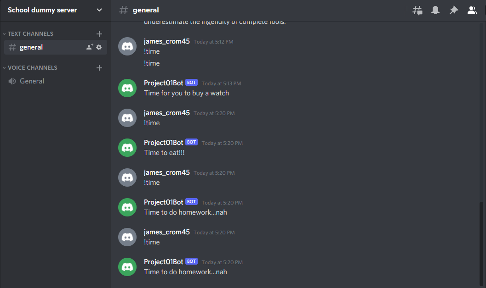

# Research and Documentation
## Setup
### How to get the API Token
1. Link you Discord account in the Discord Developer portal
2. Create an application (Name in appropriately) 
3. Under the bot tab, **Build-A-Bot**
4. In the bot tab, there will be a **Click to Reveal token**, a **Copy** button, and a **Regenerate** button.
5. **Click to Reveal Token** or **Copy** will get you the token.
### Where to put the token
1. After you create a directory for the Discord bot. Enter the folder that contains the bot python file.
2. Create an .env file
3. The file should be set up like:
```
# .env
DISCORD_TOKEN={your-bot-token}
```
4. The goes after *DISCORD_TOKEN* without the { }
### Dependencies
- You will need a few packages:
	1. You will need Python 3 to run the bot: `sudo apt install python3`
	2. Pip is needed to install other packages later: `sudo apt install python3-pip` 
	3. The Discord package will be required for the code to work: `pip install -U discord.py`
	4. Lastly you will need dotenv to load env variables: `pip install -U python-dotenv`
## Usage
### Message Command
- If a user types **!time**, they will receive a "joke quote" about time
### Quotes
- Time to buy a watch
- Time to eat!!!
- Time to sleep...zzz
- Time to do homework...nah
### Example

### Research
## Solution
- A solution that work and that currently in use is hosting services that you can run the bots remotely so that the bot doesn't tax the owner's c0mputer. These services charge a monthly fee that isn't too expensive and give the server space required to run the bot. 
- Here is a source that lists some of the current hosting services (This article focuses on discord uses) [Geekflare](https://geekflare.com/discord-bot-hosting/)
