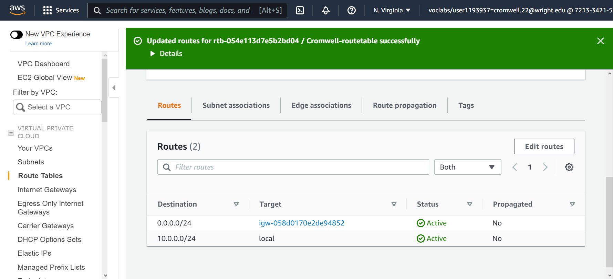

# Task 01
1. Create a VPC 
- 
2. Create a Subnet
- 
3. Create an internet gateway6
- 
4. Create a route table
- 
5. Create a security group
- 

# Task 02
1. Click Launch Instance. Next select "AMI". On the next screen, click "t2.micro".
2. On the next screen under network, select the VPC that you created.
3. The IP address will not be auto assigned as later the IP address will need to be associated to this instance.
4. On the volumes screen, in order to attach a volume you will need to click "Add New Volume" and select a device type.
5. On the next screen create a name tag by clicking "click to add a Name tag" then putting "LastName-instance".
6. Next, to add your security group select "Select an existing security group" and pick the one you created.
7. Under the Elastic IP section of aws site select "Allocate Elastic IP address" Then keep "Amazon's pool of Ipv4 addresses", give it a name tag of "LastName-EIP", and click "Allocate". In the Elastic IPs page highlight the newly obtained elastic IP and click "Actions" then "Associate Elastic IP Address". On the next page, select the instance that you created and click "Associate".
8. Example

9. I had the instance up and running but was unable to ssh into it. To change hostname you can use the command hostname "name here". This will change upon rebooting but if you want to change it permanently use "sudo hostnamectl set-hostname "name here".
10. :( (Will ask what went wrong during office hours.)
