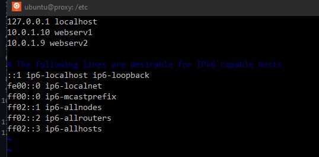
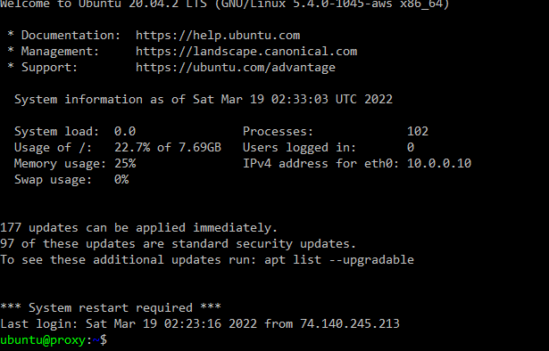
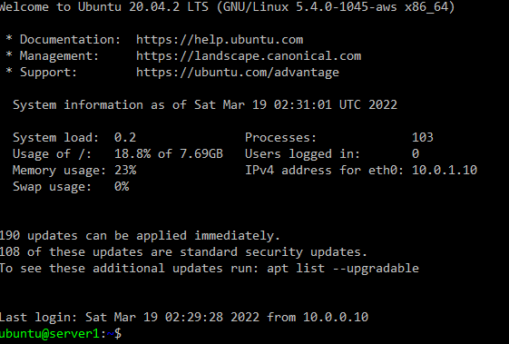
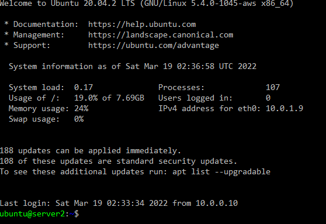
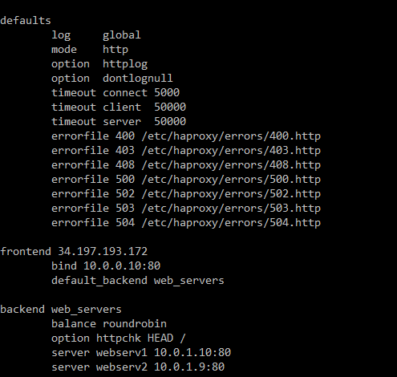
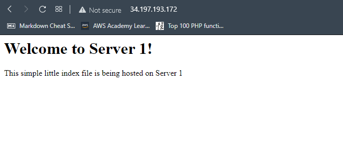
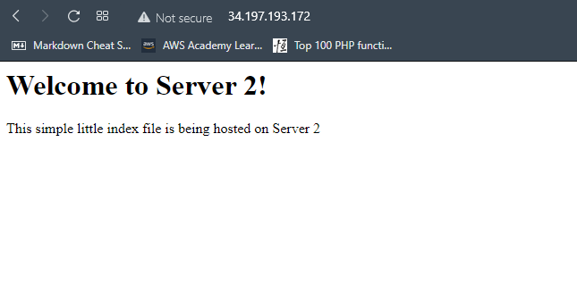

# Project 04
---

## Part 1
### Cf file in project folder
---
## Part 2
1. I configured the etc/hosts file to include all three servers on the nertwork. Each line needs a private ip address and a name for the address. Work below:
  - This was done on all three instances. 
  - 
2. After adding all of the ips and names to the hosts file you can use the command ssh -i nameofkey.pem nameofinstance. My command was `ssh -i nameofkey.pem webserv1`. Work below:
  - This is all instances after sshing into them. 
  -   
3. The haproxy config file is located in the /etc/haproxy folder and in order to access it a user needs root permissions. In my file I left the defaults alone and added the frontend and backend sections to connect my webservers. After setting those configurations I ran sudo systemctl haproxy restart to check for errors and to restart haproxy. Work below:
  - This is an image of the changes I added in the config file: 
  - 
4. With Apache2 installed there is not much to change in order to get your web page to display in browser. All I changed was the index.html file in the /var/www/html. This allowed me to display the html file that was provided for the project. The command to restart apache2 is `sudo service apache2 restart`.
5.  
### The resource I used was [Haproxy](https://www.haproxy.com)
---
