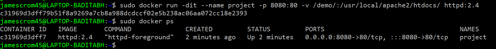
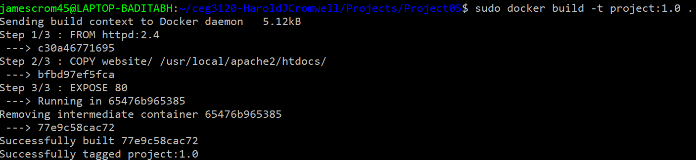
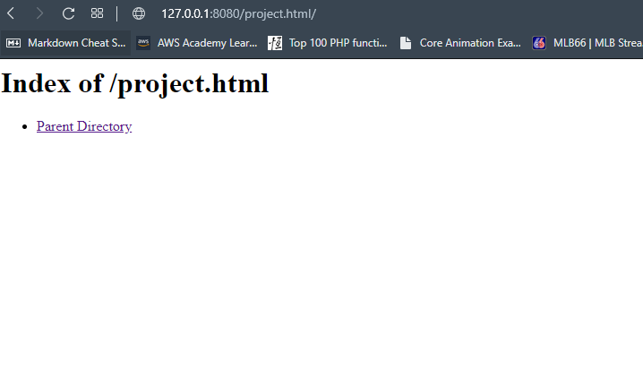
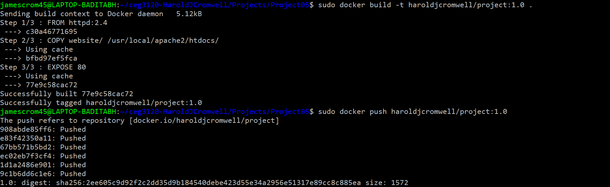
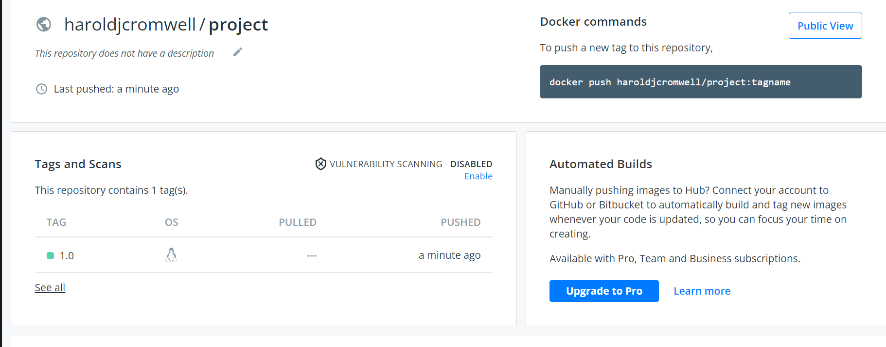
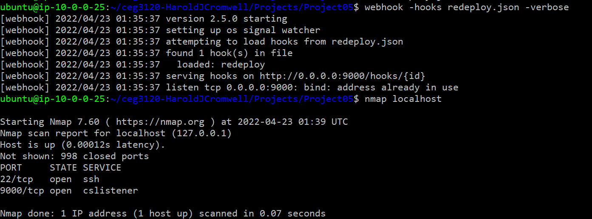
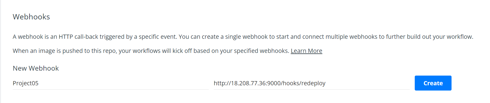

# Project05
## Name: Harold Cromwell
## Email: cromwell.22@wright.edu
--- 
### Task 01
#### How to install Docker
- I used the guide from docker to install so I will be basing my instructions from there.
1. You will need to make sure that there are no old versions on your system before the new installation
	- Run the command `sudo apt-get remove docker docker-engine docker.io containerd runc`
2. Next, you will need to update your system
	- Run the command `sudo apt update`
3. Now, you will need to install the following packages: ca-certificates, curl, gnupg, lsbrelease.
	- Run the command `sudo apt-get install \ ca-certificates \curl \gnupg \lsb-release`
4. Download Dockerhub's public key.
	- Run the command `curl -fsSL https://download.docker.com/linux/ubuntu/gpg | sudo gpg --dearmor -o /usr/share/keyrings/docker-archive-keyring.gpg`
5. You will need to setup a repository
	- Run the command `echo \
  "deb [arch=$(dpkg --print-architecture) signed-by=/usr/share/keyrings/docker-archive-keyring.gpg] https://download.docker.com/linux/ubuntu \
  $(lsb_release -cs) stable" | sudo tee /etc/apt/sources.list.d/docker.list > /dev/null`
#### How to install Docker Engine
1. Update your system once again.
	- Run the command `sudo apt update`
2. Install the following packages: docker-ce, docker-ce-cli, containerd.io.
	- Run the command sudo apt-get install docker-ce docker-ce-cli containerd.io
3. You are now ready to start creating containers and images but to be safe try to run the hello-world image
	- Run the command `sudo docker run hello-world`
#### How to build and run the container
1. To build the container with just a command I ran `docker run -dit --name project05 -p 8080:80 -v /website:/usr/local/apache2/htdocs/ httpd:2.4`
	- I ran this assuming the the html file I needed was in the website folder
	- Image Below:
	- 
2. In order to build the image using a Dockerfile I ran `docker build -t haroldjcromwell/project:1.0`
	- This is the image that I used to push to dockerhub aswell
	- The lines of code shown in the Dockerfile have comments explaining what each does.
	- The Dockerfile needs to be in the same directory if the `-f` is not used. 
	- Image Below (I made two images with the same Dockerfile this was the first before theone I used for Dockerhub):
	- 
3. In order to run the container, I ran `docker run -dit --name project05 -p 8080 haroldjcromwell/project`
4. If you want to view this in browser you use this address `publicipaddress:8080/yourwebpage.html`
	- I got a weird result when looking in the browser I'm not sure what went wrong. I have a image of it below:
	- 
---
### Task 02
#### How to create a Dockerhub Repository
1. In the repository section of Dockerhub select `Create Repository`.
2. Give the repository a name and select `Public` then hit create
3. All Done!
4. This is just the results of me pushing to the repo:
	- 
	- 
#### How to Authenticate with DockerHub via CLI using Dockhub credentials
1. Dockerhub uses tokens to authenticate. This is a more secure way of authentication and you can see more people moving towards this way. 
2. In order to get you token you will need to go to `Account Settings` then to `Security`.
3. Click on `New Acces Token`
4. Name the token and give the permissions you want then hit `Create`.
5. Save this token it will be needed.
#### How to set Github Secrets
1. Login to your Github account and selct the repository you want to use.
2. Click `Settings`
3. Under the Security tab, click `Secrets/Actions`
4. Click `New repository secret`
5. We will need a username and password secret so name one `DOCKER_USERNAME` and the other `DOCKER_PASSWORD`
6. The username value will just be your Dockerhub username but the password needs to be your token that you generated.
#### How Github workflow works
- This is where I struggled to get things to work but I went through and atleast tried and I have a understanding of how it is supposed to work.
- The workflow we used checks for changes in the project repository. If a change is made, the script will build and push an image to Dockehub using the credentials given in the code.(The username and password(token)) This should work as long as the correct repository is given in the code and the secrets are set in the repository settings.
---
### Task 03
#### The Restart Script
- The restart script (I named it redeploy and it it is inside the scripts folder) pulls the image, stops the image, and finally runs it again.
- This is to get the new version of the image and run with the new update.
#### Webhook task definition file
- I made two of these files. I made the yaml first and ran into the same problems as we did in class and so I made a json to complete the task. The yaml will be in the repository but the json is what I used.
- The point of the webhook file is to be the end location for Dockerhub to send data to when Github pushes its image. When the code runs it points to another script and that script automatically updates the container with the new image as explained before.
#### Setting up webhook on the server
1. Make sure you have your scripts in the correct locations.
2. Run the command `webhook -hooks redeploy.json -verbose`. This will create a hook on the system and now Dockerhub has a location to send the data.
3. I made the same mistake in class when running the webhook command but I also ran nmap to show that it was listening on port 9000.
	- Image Below:
	- 
#### Setting up the Dockerhub notifier
1. On Dockerhub, in your repository select `Webhooks`.
2. Give a name to your webhook and supply the address to the hook.
	- It should look something like this `http://publicipaddress:9000/hooks/hookName`
	- Image Below:
	- 
---
### Task 04
#### Workflow diagram supplied in repository as pdf.
